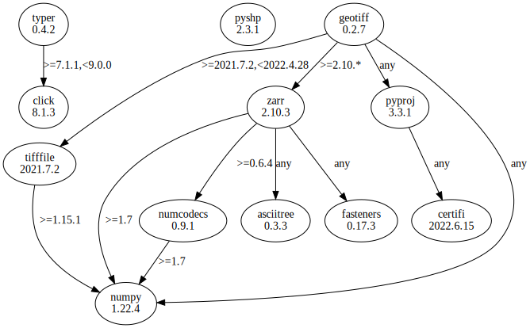

# Third Party Dependencies

<!--[[[fill sbom_sha256()]]]-->
The [SBOM in CycloneDX v1.4 JSON format](https://github.com/sthagen/pilli/blob/default/sbom.json) with SHA256 checksum ([344e3bf0 ...](https://raw.githubusercontent.com/sthagen/pilli/default/sbom.json.sha256 "sha256:344e3bf02d779d1852b0f866f80735d3fa47d7be0ab8226cb6b25e1087f4482d")).
<!--[[[end]]] (checksum: 1ac2d5180632150ffbf989b813377fec)-->
## Licenses 

JSON files with complete license info of: [direct dependencies](direct-dependency-licenses.json) | [all dependencies](all-dependency-licenses.json)

### Direct Dependencies

<!--[[[fill direct_dependencies_table()]]]-->
| Name                                                          | Version                                          | License                                                 | Author            | Description (from packaging data)                                  |
|:--------------------------------------------------------------|:-------------------------------------------------|:--------------------------------------------------------|:------------------|:-------------------------------------------------------------------|
| [geotiff](https://github.com/Open-Source-Agriculture/geotiff) | [0.2.7](https://pypi.org/project/geotiff/0.2.7/) | GNU Lesser General Public License v2 or later (LGPLv2+) | Kipling Crossing  | A noGDAL tool for reading and writing geotiff files                |
| [pyshp](https://github.com/GeospatialPython/pyshp)            | [2.3.1](https://pypi.org/project/pyshp/2.3.1/)   | MIT                                                     | Joel Lawhead      | Pure Python read/write support for ESRI Shapefile format           |
| [typer](https://github.com/tiangolo/typer)                    | [0.4.2](https://pypi.org/project/typer/0.4.2/)   | MIT License                                             | Sebastián Ramírez | Typer, build great CLIs. Easy to code. Based on Python type hints. |
<!--[[[end]]] (checksum: 659454d820e32806befbbfac601525a6)-->

### Indirect Dependencies

<!--[[[fill indirect_dependencies_table()]]]-->
| Name                                          | Version                                        | License     | Author         | Description (from packaging data)         |
|:----------------------------------------------|:-----------------------------------------------|:------------|:---------------|:------------------------------------------|
| [click](https://palletsprojects.com/p/click/) | [8.1.3](https://pypi.org/project/click/8.1.3/) | BSD License | Armin Ronacher | Composable command line interface toolkit |
<!--[[[end]]] (checksum: dc3a866a7aa3332404bde3da87727cb9)-->

## Dependency Tree(s)

JSON file with the complete package dependency tree info of: [the full dependency tree](package-dependency-tree.json)

### Rendered SVG

Base graphviz file in dot format: [Trees of the direct dependencies](package-dependency-tree.dot.txt)



### Console Representation

<!--[[[fill dependency_tree_console_text()]]]-->
````console
geotiff==0.2.7
  - numpy [required: Any, installed: 1.22.4]
  - pyproj [required: Any, installed: 3.3.1]
    - certifi [required: Any, installed: 2022.6.15]
  - tifffile [required: >=2021.7.2,<2022.4.28, installed: 2021.7.2]
    - numpy [required: >=1.15.1, installed: 1.22.4]
  - zarr [required: >=2.10.*, installed: 2.10.3]
    - asciitree [required: Any, installed: 0.3.3]
    - fasteners [required: Any, installed: 0.17.3]
    - numcodecs [required: >=0.6.4, installed: 0.9.1]
      - numpy [required: >=1.7, installed: 1.22.4]
    - numpy [required: >=1.7, installed: 1.22.4]
pyshp==2.3.1
typer==0.4.2
  - click [required: >=7.1.1,<9.0.0, installed: 8.1.3]
````
<!--[[[end]]] (checksum: 12b6b331ac901b6ca7947fb6c50a25be)-->
