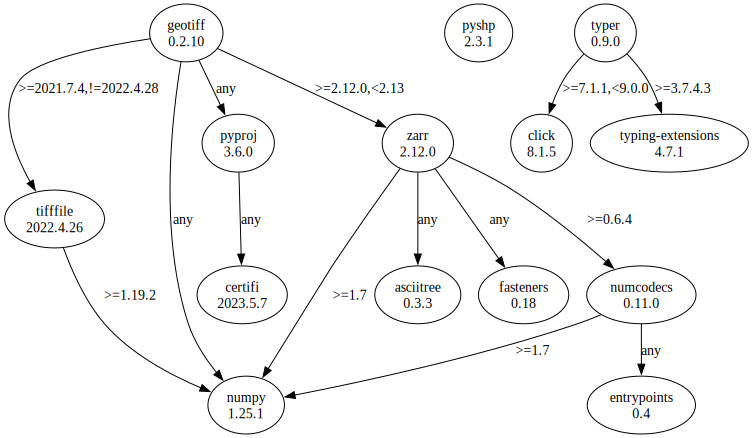

# Third Party Dependencies

<!--[[[fill sbom_sha256()]]]-->
The [SBOM in CycloneDX v1.4 JSON format](https://git.sr.ht/~sthagen/attribuutit/blob/default/sbom/cdx.json) with SHA256 checksum ([ba49cbb3 ...](https://git.sr.ht/~sthagen/attribuutit/blob/default/sbom/cdx.json.sha256 "sha256:ba49cbb31dda31c7fe6f4b317d93fdafa5a281fcd0c6c1e0698d6bc330cf2836")).
<!--[[[end]]] (checksum: b7a02ac2886b9a597b554a5653dba6c3)-->
## Licenses 

JSON files with complete license info of: [direct dependencies](direct-dependency-licenses.json) | [all dependencies](all-dependency-licenses.json)

### Direct Dependencies

<!--[[[fill direct_dependencies_table()]]]-->
| Name                                                          | Version                                          | License                                                 | Author            | Description (from packaging data)                                  |
|:--------------------------------------------------------------|:-------------------------------------------------|:--------------------------------------------------------|:------------------|:-------------------------------------------------------------------|
| [geotiff](https://github.com/Open-Source-Agriculture/geotiff) | [0.2.9](https://pypi.org/project/geotiff/0.2.9/) | GNU Lesser General Public License v2 or later (LGPLv2+) | Kipling Crossing  | A noGDAL tool for reading and writing geotiff files                |
| [pyshp](https://github.com/GeospatialPython/pyshp)            | [2.3.1](https://pypi.org/project/pyshp/2.3.1/)   | MIT                                                     | Joel Lawhead      | Pure Python read/write support for ESRI Shapefile format           |
| [typer](https://github.com/tiangolo/typer)                    | [0.9.0](https://pypi.org/project/typer/0.9.0/)   | MIT License                                             | Sebastián Ramírez | Typer, build great CLIs. Easy to code. Based on Python type hints. |
<!--[[[end]]] (checksum: 5bfb89550cac75588bc9fe86aa43b9ce)-->

### Indirect Dependencies

<!--[[[fill indirect_dependencies_table()]]]-->
| Name                                                      | Version                                                   | License                              | Author                                      | Description (from packaging data)                                                          |
|:----------------------------------------------------------|:----------------------------------------------------------|:-------------------------------------|:--------------------------------------------|:-------------------------------------------------------------------------------------------|
| [asciitree](http://github.com/mbr/asciitree)              | [0.3.3](https://pypi.org/project/asciitree/0.3.3/)        | MIT                                  | Marc Brinkmann                              | Draws ASCII trees.                                                                         |
| [certifi](https://github.com/certifi/python-certifi)      | [2023.5.7](https://pypi.org/project/certifi/2023.5.7/)    | Mozilla Public License 2.0 (MPL 2.0) | Kenneth Reitz                               | Python package for providing Mozilla's CA Bundle.                                          |
| [click](https://palletsprojects.com/p/click/)             | [8.1.5](https://pypi.org/project/click/8.1.5/)            | BSD License                          | UNKNOWN                                     | Composable command line interface toolkit                                                  |
| [entrypoints](https://github.com/takluyver/entrypoints)   | [0.4](https://pypi.org/project/entrypoints/0.4/)          | MIT License                          | Thomas Kluyver                              | Discover and load entry points from installed packages.                                    |
| [fasteners](https://github.com/harlowja/fasteners)        | [0.18](https://pypi.org/project/fasteners/0.18/)          | Apache Software License              | Joshua Harlow                               | A python package that provides useful locks                                                |
| [numcodecs](https://github.com/zarr-developers/numcodecs) | [0.11.0](https://pypi.org/project/numcodecs/0.11.0/)      | MIT License                          | Alistair Miles                              | A Python package providing buffer compression and transformation codecs for use            |
| [numpy](https://www.numpy.org)                            | [1.25.1](https://pypi.org/project/numpy/1.25.1/)          | BSD License                          | Travis E. Oliphant et al.                   | Fundamental package for array computing in Python                                          |
| [pyproj](https://github.com/pyproj4/pyproj)               | [3.6.0](https://pypi.org/project/pyproj/3.6.0/)           | MIT License                          | Jeff Whitaker <jeffrey.s.whitaker@noaa.gov> | Python interface to PROJ (cartographic projections and coordinate transformations library) |
| [tifffile](https://www.lfd.uci.edu/~gohlke/)              | [2022.4.26](https://pypi.org/project/tifffile/2022.4.26/) | BSD License                          | Christoph Gohlke                            | Read and write TIFF files                                                                  |
| [zarr](https://github.com/zarr-developers/zarr-python)    | [2.15.0](https://pypi.org/project/zarr/2.15.0/)           | MIT License                          | Alistair Miles                              | An implementation of chunked, compressed, N-dimensional arrays for Python                  |
<!--[[[end]]] (checksum: 0ff9c7be3cbfafe340c93fd7dfdaab77)-->

## Dependency Tree(s)

JSON file with the complete package dependency tree info of: [the full dependency tree](package-dependency-tree.json)

### Rendered SVG

Base graphviz file in dot format: [Trees of the direct dependencies](package-dependency-tree.dot.txt)



### Console Representation

<!--[[[fill dependency_tree_console_text()]]]-->
````console
geotiff==0.2.9
├── numpy [required: Any, installed: 1.25.1]
├── pyproj [required: Any, installed: 3.6.0]
│   └── certifi [required: Any, installed: 2023.5.7]
├── tifffile [required: >=2021.7.2,<2022.4.28, installed: 2022.4.26]
│   └── numpy [required: >=1.19.2, installed: 1.25.1]
└── zarr [required: >=2.10.0, installed: 2.15.0]
    ├── asciitree [required: Any, installed: 0.3.3]
    ├── fasteners [required: Any, installed: 0.18]
    ├── numcodecs [required: >=0.10.0, installed: 0.11.0]
    │   ├── entrypoints [required: Any, installed: 0.4]
    │   └── numpy [required: >=1.7, installed: 1.25.1]
    └── numpy [required: >=1.20, installed: 1.25.1]
pyshp==2.3.1
typer==0.9.0
├── click [required: >=7.1.1,<9.0.0, installed: 8.1.5]
└── typing-extensions [required: >=3.7.4.3, installed: 4.7.1]
````
<!--[[[end]]] (checksum: 845e1bd1dc89de3d4e6a4d29269c70c1)-->
